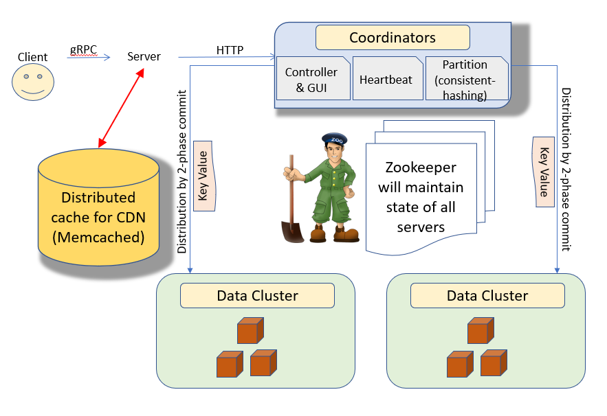
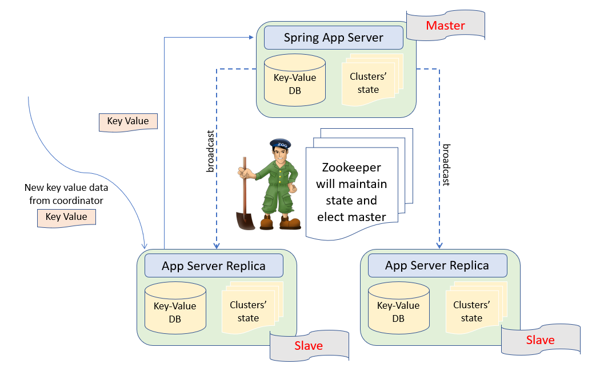
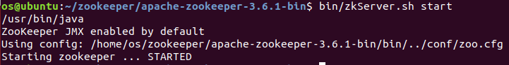
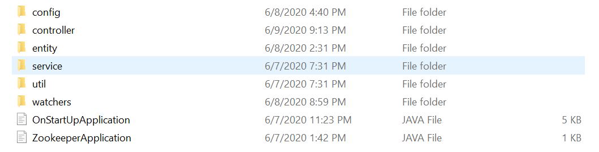
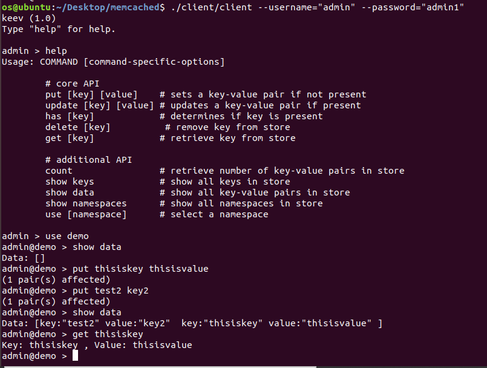
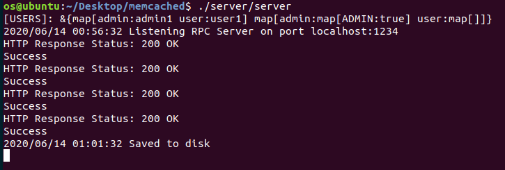
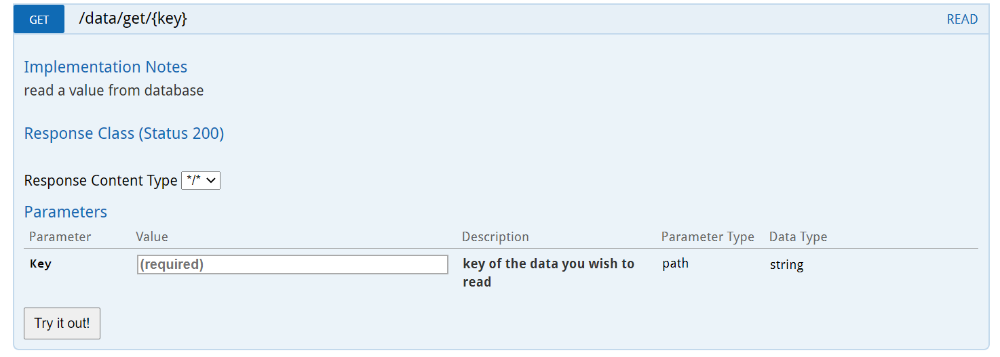
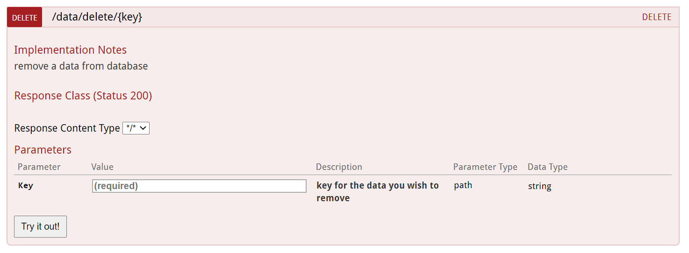
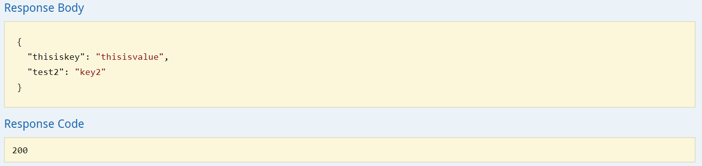

# Distributed Key Value Database

Distributed key value storing system aiming for low latency, high availability and partition tolerance

## Suitable use case for this design

- High read volume
- Low write
- Sparse concurrent users
- Availability & Partition Tolerance > Consistency
- High performance read

## Architecture

### Client-server coordinators



1. Users communicate with client coordinator through gRPC.
2. Upon receiving read request, client coordinator will first check distributed cache(CDN) for data. If unavailable in cache, client coordinator will contact server coordinator.
3. Server coordinators are implemented as a cluster managed by Zookeeper for Primary-Backup model.
4. Server coordinator will first preprocess the data then distribute them to required data clusters through consistent hashing(for load-balance).
4. Every data write operation will be safecheck completion through 2-phase commit to ensure final consistency.
5. Data read not required to do any safecheck to ensure performance and latency.

[Client Coordinator and gRPC](./cache/memcached)  
[Server Coordinator](./coordinator/zookeeper)

### Data Clusters



1. Every machine is capable to store key value data in RAM and then to disk periodically if not read in a fix timer.
2. Design philosophy will follow master slave design. The election of master is implemented using Ephemeral ZNodes in Zookeeper.
3. Only master is capable of serving update request while all master or slave servers are capable of serving read request.
4. When a server coordinator send an update request to data node, request will always forwarded to master in the respective cluster.
5. Master server will do all the required storage procedure then broadcast commited operations to all slave nodes in the cluster.
6. Any node in the cluster is capable to serve read request(therefore server coordinators are designed to do load balancing).
7. All data nodes maintain a clusters' state and in event of master server breakdown, zookeeper watcher will notify all nodes and the first node in /election znode will be elected as new master.
8. All slave nodes periodically sync data with master server(this is needed as data write broadcast might lost and we need to ensure all nodes in the cluster store the same data).

[data nodes](./data/zookeeper)

### Requirements

- Node - Multiple machines in Amazon Cloud managed by Zookeeper
- Communication 
    - client-server communication - Implemented by gRPC
    - server-server communication - Implemented by REST
- Data Format - Key Value
- Partition & Scalability - Multiple nodes capable to serve as primary backup model and write controlled by master-slave model
- Concurrency Data Accessing - Implemented through Java Concurrent Map and Zookeeper distributed lock
- High Availability - Zookeeper to determine node condition and elect new leader/master

## Usage

- Building a zookeeper cluster
    1. Download zookeeper release from https://zookeeper.apache.org/releases.html
    2. Uncompress tar files ```sudo tar -zxf zookeeper-3.6.1.tar.gz```
    3. Make data and logs in zookeeper directory ```mkdir data & mkdir logs```
    4. Modify zokeeper/conf/zoo.cfg to as provided(they are different in every cluster. Need to modify according to own clusters' ip addresses)
    5. In every machine, after completed above steps, run ```/bin/zkServer.sh start```
        
    6. We can access these zookeeper server by using ```/bin/zkCli.sh -server k4:2181,k2:2181,k3:2181```. However, this is not mandatory as we will use Zkclient to control our zk servers
    7. We can check zk status using ```/bin/zkServer.sh status```
    8. Due to simplicity, we will use Zkclient imported by maven in our Spring project to configure zookeeper in our machines
        - In pom.xml, inject dependencies: 
            ```
            <dependency>
			    <groupId>com.101tec</groupId>
			    <artifactId>zkclient</artifactId>
			    <version>0.11</version>
			    <exclusions>
				    <exclusion>
					    <groupId>org.slf4j</groupId>
					    <artifactId>slf4j-api</artifactId>
				    </exclusion>
			    </exclusions>
		    </dependency>
            <dependency>
			    <groupId>org.apache.zookeeper</groupId>
			    <artifactId>zookeeper</artifactId>
			    <version>3.6.1</version>
            </dependency>
            ```
    9. This is a sample directory of 1 of the Spring Projects:
        
        - Most of the zookeeper services can be found under /service/ZKService.java
        - All watchers will be initiated in OnStartUpApplication.java
        - All notifications and watchers' logic at runtime can be found under /watchers/*

- Running client coordinator/CDN cache  
    [Client Coordinator and gRPC](./cache/memcached/README.md)

- Running server coordinator  
    [Server Coordinator](./coordinator/zookeeper/README.md)

- Building data nodes clusters  
    [data nodes](./data/zookeeper/README.md)

## Example










## Tech Stack

- Apache Zookeeper
- Spring Cloud
- MySQL
- gRPC
- Memcached
- Swagger2

## Special Thanks

School Of Software Engineering, Shanghai Jiao Tong University - *SE347(Distributed System)*