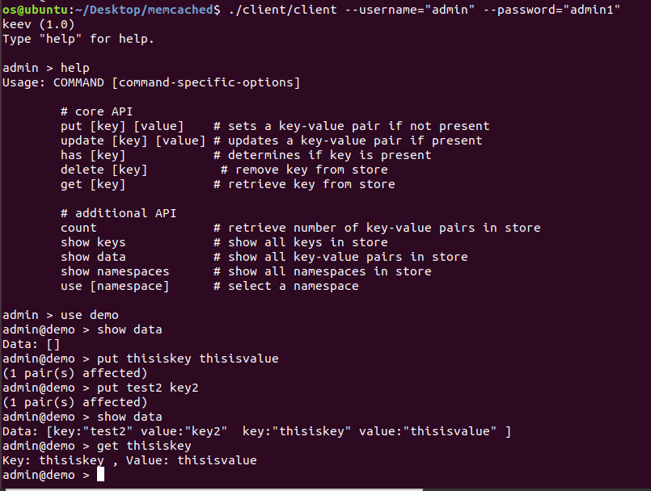
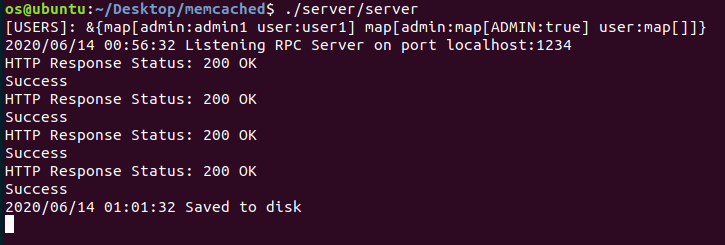

# Implementation of RPC and distributed cache using Memcached for CDN

A simple client side coordinator for distributed key-value store built on top of hash tables using Go. User(client) communicate with coordinator(server) using gRPC and Google Protocol Buffers(protobufs). Data persist to disk or removed from disk every 5 minutes.

## Architecture

High-level overview:  

                 ┌ ─ ─ ─ ─ ─ ─ ─ ─ ─ ─ ─ ─ ─ ─ ─ ─ ─ ─ ─ ─ ─ ─ ─ ┐
                                      Clients
                 └ ─ ─ ─ ─ ─ ─ ─ ─ ─ ─ ─ ─ ─ ─ ─ ─ ─ ─ ─ ─ ─ ─ ─ ┘
                                        ▲
                                        │
                                        │ Google Protocol Buffers
                                        │
                                        ▼
                 ┌───────────────────────────────────────────────┐
                 │                   Servers                     │-----> coordinator server clusters
                 └───────────────────────────────────────────────┘
                 ┌───────────────────────────────────────────────┐
                 │                 RAM or disk                   │
                 └───────────────────────────────────────────────┘

## core API

Common API:  
- PUT key value (valid if key is not present)
- UPDATE key value (valid if key is present)
- HAS key
- DELETE key
- GET key

Additional API:  
- COUNT
- SHOW KEYS
- SHOW DATA

Security and Authentication API:  
- SHOW NAMESPACES
- USE namespace

Restrictions:  
* Both `key` and `value` cannot contain spaces.
* `key` cannot contain dots.
* Only alphanumeric characters are allowed for `namespace`

## Usage

1. Generate certificates for RPC: `go run generate_cert.go --host=localhost`

2. Change `JWTSigningToken` in `common/jwt.go`(for authenticator, ignore if not used)

3. Define a list of users in `data/users.json`.
    Sample:
    ```json
    [
      {
        "username": "admin",
        "password": "password",
        "perms": ["ADMIN"]
      },
      {
        "username": "user",
        "password": "userpassword",
        "perms": []
      }
    ]
    ```

4. To run, build all the Go binaries then run:
Server: `./server`
Client: `./client --username="user" --password="userpassword"`

## Example

### Client



### Server



## Future work

- [ ] Permissions for users
- [ ] Tests
- [ ] Logs
- [ ] Own SQL-like syntax with lexer and parser
- [ ] Transactions
- [ ] Support for various types: numbers, etc.
- [ ] Drivers for other languages
- [ ] Scaling/fault-tolerant system using Raft/Paxos
