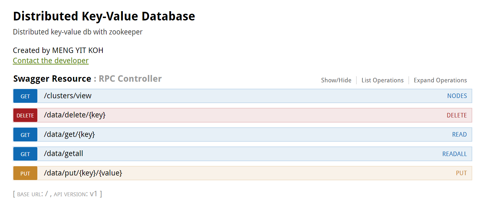
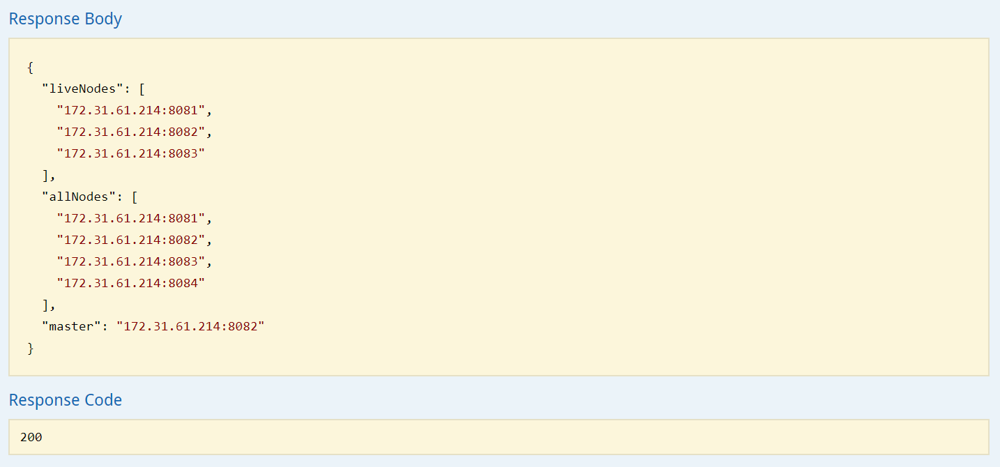

# Server coordinator

Implementaion of server coordinator in this distributed key value database. These coordinators are suppose to handle all request from client coordinators and do load balancing for requests.

## Usage

1. Build zookeeper servers in multiple process or multiple machines
2. Compile project source files into java executable using ```mvn install -DskipTests```
3. Place java executable(located in /target/) and serverlist.json(need to fill in available data clusters nodes entrypoint) to multiple deployment machines
1. Run in multiple instances or in multiple machines:
    ```
    java -Dserver.port=8082 -Dserverlist=./serverlist.json -Dzk.url=localhost:2181 -Dleader.algo=2 -jar zookeeper-0.0.1-SNAPSHOT.jar
    ```

## Example


