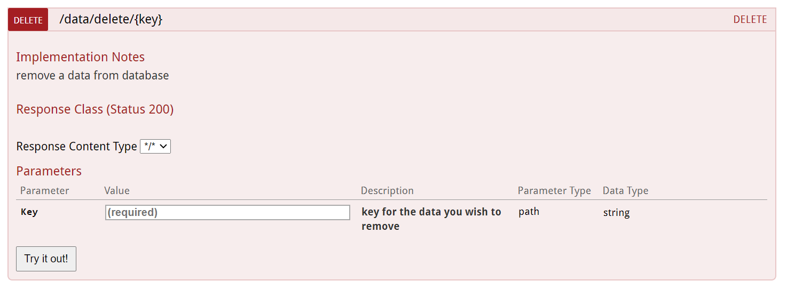
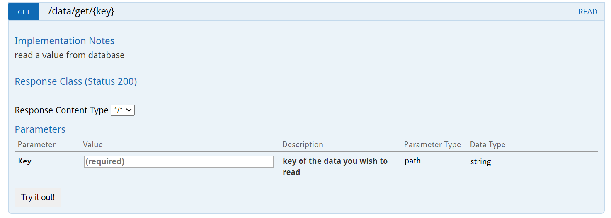
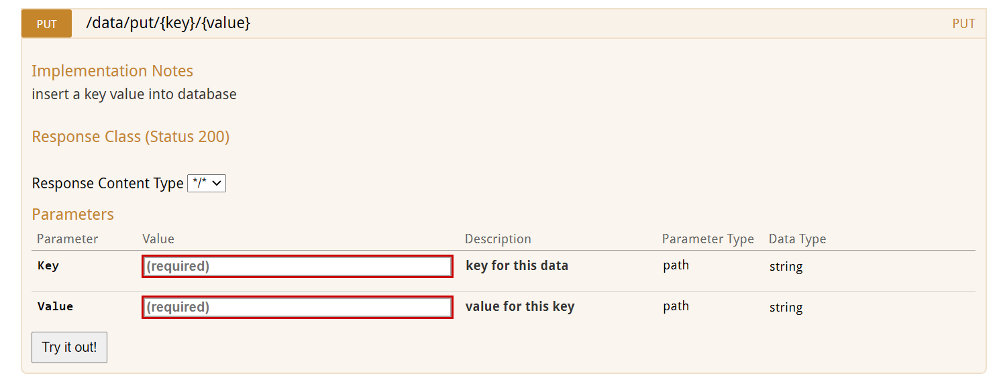

# Data Clusters

Implementation of distributed data node clusters in this distributed key value database. These nodes are lead by a master and are supposed to handle failure through multiple primary-backup replicas. Nodes will practice casual eventual cosistency model by syncing with master after a specific timer. Data might get outdated in some reads in some specific timer or some specific network condition.

## Usage

1. Build zookeeper servers in multiple process or multiple machines
2. Compile project source files into java executable using ```mvn install -DskipTests```
3. Place java executable(located in /target/) to multiple deployment machines
1. Run in multiple instances or in multiple machines:
    ```
    nohup java -Dserver.port=8082 -Dzk.url=localhost:2181 -Dleader.algo=2 -jar zookeeper-0.0.1-SNAPSHOT.jar&
    ```

## Example



